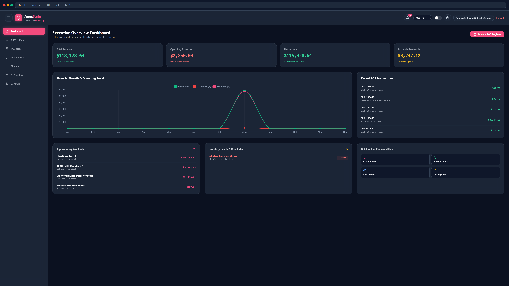
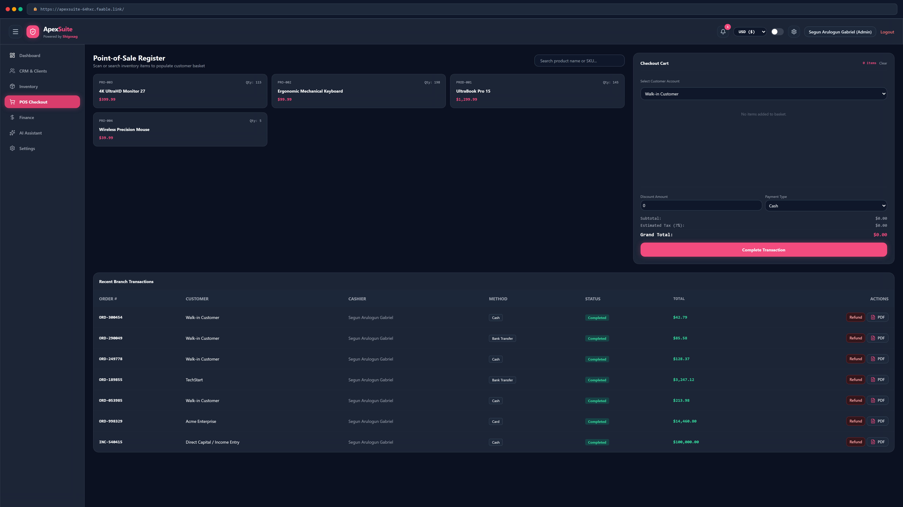
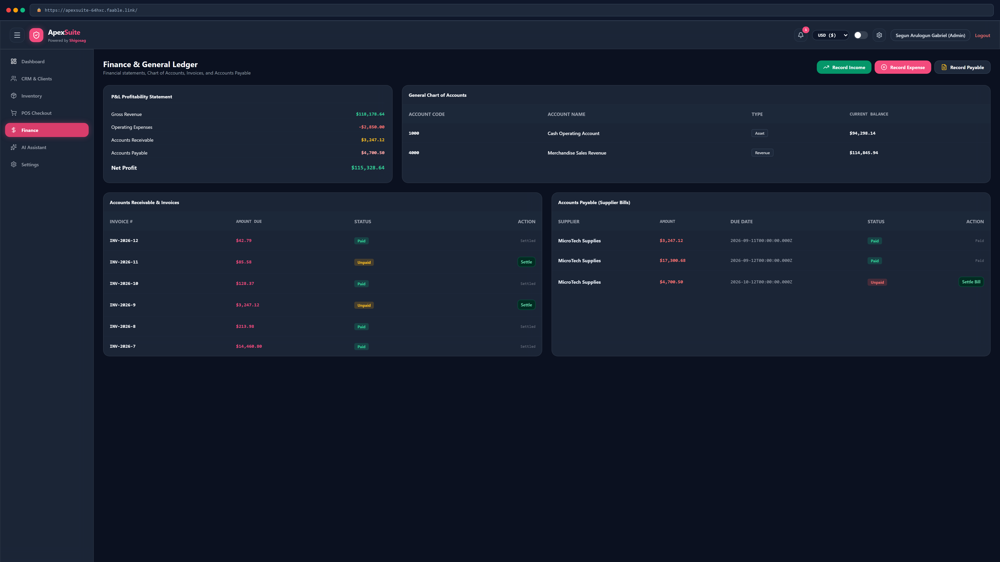
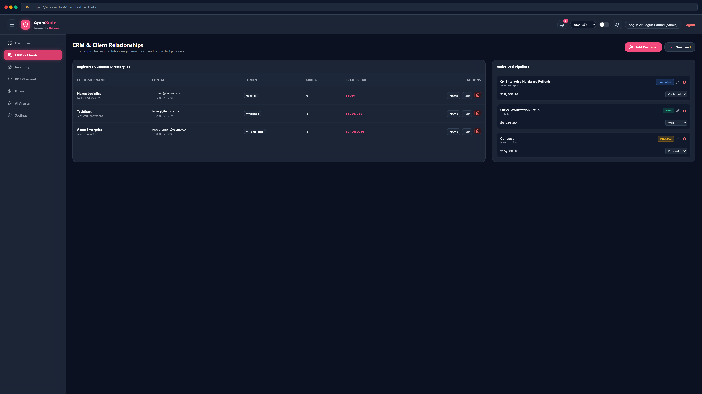

# 💖 ApexSuite — Enterprise AI-Powered Business Management System

[](https://nodejs.org/)
[](https://neon.tech/)
[](https://expressjs.com/)
[](LICENSE)

Shigosag **ApexSuite** is a production-ready, enterprise-grade AI-powered Business Management System (ERP, CRM, POS & Finance) engineered to unify multi-branch operations, real-time inventory tracking, customer pipelines, and financial ledgers into a seamless single-page web application.

Offered by **Shigosag**  
Brand Accent: `#f34b7d`

---

## 🌐 Live URL
🚀 **Visit ApexSuite Enterprise:**  
https://apexsuite-64hxc.faable.link

---

### 🎥 System Walkthrough & Demo

<div align="center">
  <video src="https://github.com/user-attachments/assets/sample-demo-video.mp4" width="100%" controls></video>
</div>

**Timestamps:**
- **0:00** - Workspace Login & Executive Overview
- **0:18** - POS Terminal & Automated PDF Invoicing
- **0:45** - AI Strategy Copilot & Reorder Forecasting
- **1:10** - Inventory Movements & Inter-Branch Transfers
- **1:30** - CRM Pipeline & Engagement Notes
- **1:50** - P&L Financial Ledger & Chart of Accounts
- **2:10** - Multi-Branch Setup & Security Audit Logs

---

## ✨ Key Features

### 🛒 Point of Sale (POS) & Invoicing
* **Instant Checkout Register**: Fast cashier interface, discount application, and tax calculations.
* **Automated PDF Statements**: Server-side PDF receipt generation via PDFKit with transaction details.
* **Order Refund Management**: Integrated order refund execution with status updates and ledger adjustments.

### 🤖 AI Strategy Copilot
* **Natural Language Queries**: Instant answers for stock forecasts, sales volume, and spending audits.
* **Economic Reorder Engine**: Automated purchase order quantity and cost recommendations.
* **P&L Margin Analysis**: Real-time margin ratio metrics and revenue growth strategies.

### 📦 Inventory & Multi-Branch Warehouse
* **Low-Stock Alert System**: Automated alert badges and background task monitoring.
* **Inter-Branch Stock Transfers**: Atomic inventory transfers across branch locations.
* **Directory Management**: Integrated product category and supplier directory tracking.

### 👥 CRM & Deal Pipelines
* **Customer Profiling**: Lifetime spend tracking, total order counts, and segmentation.
* **Engagement History**: Activity timeline with staff communication notes per client account.
* **Deal Sales Pipeline**: Visual deal stage management (`New`, `Contacted`, `Proposal`, `Won`, `Lost`).

### 💰 Finance & Accounting Ledger
* **P&L Profitability Summary**: Live Gross Revenue, Operating Expenses, and Net Operating Profit calculations.
* **Invoices & Payables**: Complete Accounts Receivable and Accounts Payable tracking.
* **General Chart of Accounts**: Double-entry asset, liability, revenue, and expense ledgers.

### 🛡️ Administration & Security
* **Role-Based Access Control (RBAC)**: Fine-grained permissions (`Admin`, `Manager`, `Employee`).
* **Security Audit Trail**: Non-blocking telemetry capturing actions, timestamps, and IP addresses.
* **JWT & Rate Limiting**: Dual-token authentication with IP-based authentication rate limiters.

---

## 🛠️ Tech Stack

| Layer | Technology |
| :--- | :--- |
| **Frontend** | Vanilla ES6 Modular SPA, Tailwind CSS (Glassmorphism), Lucide Icons, Chart.js |
| **Backend** | Node.js (v22 LTS), Express 4, REST API Router |
| **Database** | Relational PostgreSQL (Neon Serverless Pool), SSL Encryption |
| **Security** | Helmet, CORS, Express Rate Limit, BCrypt.js, JWT Authentication |
| **Documents** | PDFKit Stream Renderer |
| **Testing** | Node.js Native Test Runner (`node --test`) |

---

## 🗂️ Project Structure

```txt
ApexSuite-Monorepo/
│
├── client/
│   ├── src/
│   │   ├── components/       # Header, Sidebar, Modal UI
│   │   ├── pages/            # Dashboard, CRM, Inventory, POS, Finance, AI, Settings
│   │   ├── services/         # APIService REST client
│   │   ├── styles/           # Main CSS and glassmorphism themes
│   │   ├── index.html        # SPA Entry Page
│   │   └── main.js           # Navigation, Auth logic, Toast engine
│   └── package.json
│
├── server/
│   ├── src/
│   │   ├── config/           # Environment variables and logger
│   │   ├── controllers/      # REST API Controllers
│   │   ├── database/         # PostgreSQL connection pool and migrations
│   │   ├── jobs/             # Automated background task scheduler
│   │   ├── middleware/       # Auth JWT, RBAC, Rate limiters, Audit log
│   │   ├── repositories/     # Database data access layer
│   │   ├── routes/           # REST Route aggregation
│   │   ├── services/         # AI Strategy engine, Auth, PDF builder
│   │   ├── tests/            # Automated test suite
│   │   └── utils/            # Shared formatting helpers
│   ├── index.js              # Express server setup
│   └── package.json
│
├── docs/
│   ├── API.md                # Enterprise REST API Specification
│   └── ARCHITECTURE.md       # System Architecture & Design Specification
│
├── .github/workflows/        # CI/CD Workflows
├── docker-compose.yml        # Container composition config
├── Dockerfile                # Multi-stage production container build
├── .env.example              # Environment variables template
└── README.md
```

---

## 🖼️ Interface Preview

| Executive Overview Dashboard | POS Register Terminal |
| :---: | :---: |
|  |  |

| Finance & General Ledger | CRM & Engagement Timeline |
| :---: | :---: |
|  |  |

---

## ⚡ Quick Start (Local Development)

### Prerequisites
- Node.js (v22+ LTS)
- PostgreSQL Database Instance (or Neon Serverless Postgres)

### 1. Clone & Configure Environment
```bash
git clone https://github.com/Shigosag/ApexSuite.git
cd ApexSuite
cp .env.example .env
```
*Configure your `DATABASE_URL`, `JWT_SECRET`, and `JWT_REFRESH_SECRET` in `.env`.*

### 2. Install Workspace Dependencies
```bash
npm run install:all
```

### 3. Start Development Server
```bash
npm start
```
Open **`http://localhost:3000`** in your browser.

### 4. Run Automated Test Suite
```bash
npm test
```

### 🐳 Run with Docker
```bash
docker compose up --build
```

---

## 🔑 Default Demo Credentials

When running on a fresh database, the system automatically seeds initial demo data:

* **Email:** `admin@apex.com`
* **Password:** `admin123`

---

## 🛡️ Security & Diagnostic Logging

ApexSuite features non-blocking audit logging and background security guards. Any unauthorized API access, rate limit violation, or inventory alert triggers immediate telemetry recording without interrupting workspace performance.

---

## 👤 Author & Credits

- **Offered by Shigosag**
- Portions of code generated with AI support

*Empowering business management through high-performance software architecture.*

---

## 📄 License

MIT License © 2026 **Shigosag**
